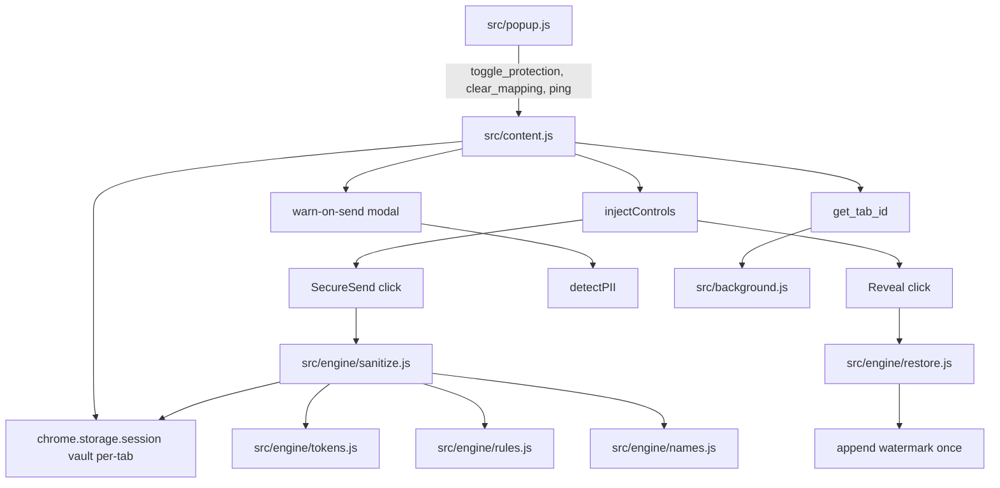

# SafePrompt Architecture (Flow)

```mermaid
flowchart TD
  Popup[src/popup.js] -->|toggle_protection, clear_mapping, ping| Content[src/content.js]
  Content --> Vault[chrome.storage.session vault per-tab]
  Content --> UI[injectControls]
  UI --> SecureSend[SecureSend click]
  SecureSend --> Sanitizer[src/engine/sanitize.js]
  Sanitizer --> Tokens[src/engine/tokens.js]
  Sanitizer --> Rules[src/engine/rules.js]
  Sanitizer --> Names[src/engine/names.js]
  Sanitizer --> Vault
  UI --> Reveal[Reveal click]
  Reveal --> DomRestore[src/engine/restore.js]
  DomRestore --> Watermark[append watermark once]
  Content --> Warn[warn-on-send modal]
  Warn --> Detector[detectPII]
  Content --> BGMsg[get_tab_id]
  BGMsg --> BG[src/background.js]
```

